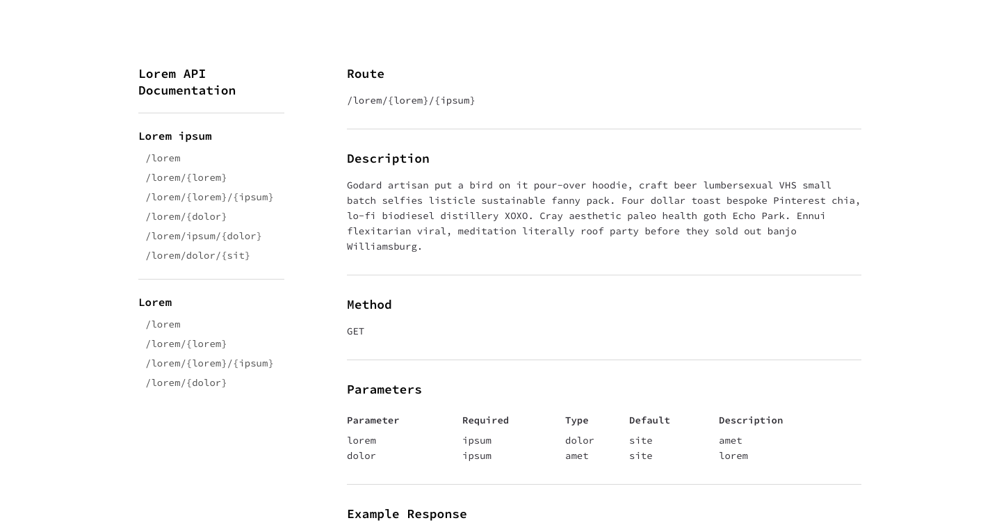

# dayThree: Docs
A ten day challenge that I've challenged myself to do. dayThree is a simple docs template when you can store tables and text, and code blocks.

# Sources used
Devtips Starter Kit:
[Get on GitHub](https://github.com/DevTips/DevTips-Starter-Kit)

Bourbon.io:
[Visit officail site](http://bourbon.io/)

